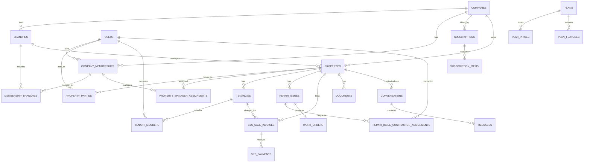

# Resisquare database and module mapping

## Recommended foundation

Retain `companies` as the SaaS workspace/tenant root, but broaden its meaning:

- `workspace_type = estate_agent` for agency customers
- `workspace_type = landlord` for self-managing landlord portfolios
- Resisquare platform administration remains outside ordinary customer workspace queries

Every paying customer therefore has a company/workspace row, including an individual landlord. This removes the dangerous situation where only agencies have a tenant key.

Do not use `created_by` as data ownership. It records who created a record. Tenant ownership is an immutable `company_id` on every customer-owned record.

## Existing-to-SaaS module mapping

| SaaS module | Existing tables/models | Mapping decision | Required change |
|---|---|---|---|
| Workspace/company | `companies`, `Company`, `company_owner_transfers` | Retain | Add workspace type, slug, lifecycle, jurisdiction and billing identity; create a company row for landlords |
| Branches | `branches`, `Branch` | Retain for agency workspaces | Enforce `company_id`, unique company/name, plan limit and agency-only policy |
| Identities | `users`, `user_details`, `User` | Retain as global person/login identity | Remove one-company assumption; enforce verification/status; encrypt/minimise sensitive fields |
| Workspace membership | `users.company_id`, `users.branch_id`, Spatie pivots | Replace as canonical access model | Add `company_memberships`, membership branches and workspace-scoped roles |
| Roles/permissions | `roles`, `permissions`, Spatie pivots, `designations`, `designation_has_permissions` | Retain concepts | Enable team/workspace scope or explicit membership-role joins; normalise permission names |
| Staff | `staff`, `staff_contacts`, `Staff`, `Designation` | Retain agency profile | Link to membership/company, support invitation status and seat usage |
| Contacts | Role-bearing users plus `users_categories` | Retain one identity/contact directory concept | Add contact/membership state so a contact need not have login or a global role |
| Properties | `properties`, `Property` | Retain rich domain record | Add mandatory `company_id`, `branch_id`, status and tenant-safe reference index |
| Landlords/owners | `Owner`/`User`, `owner_group`, `owner_group_users` | Refactor relationships | Add `property_parties`; represent landlord/owner role, ownership share and portal visibility per workspace/property |
| Property managers | `property_responsibilities`, `property_manager_tenancy`, repair manager table | Consolidate gradually | Add canonical property-manager assignments and permission/add-on checks |
| Tenancies | `tenancies`, `tenant_members`, `Tenancy` | Retain | Add mandatory `company_id`; review status/type for England 2026; use member identity links plus snapshots |
| Compliance | `compliance_types`, `compliance_records`, `compliance_details` | Retain | Add tenant key through property and optionally directly; add evidence, reminder and jurisdiction rule metadata |
| Maintenance | `repair_issues` and related repair tables | Retain table initially; label product “Maintenance” | Add `company_id`; formalise status enum, assignment visibility, SLA and portal-safe fields |
| Contractor quotes | `repair_issue_contractor_assignments` | Retain | Add company scope, token hashing/expiry/use state, contractor membership and quote audit |
| Work orders | `work_orders`, `work_order_items` | Retain | Add company key, assignment FK, tenant-safe work-order number and portal status |
| Property invoices | Legacy `invoices` plus newer `sys_sale_invoices` | Select one canonical path | Prefer newer lifecycle/GL services; add company key and migrate/deprecate legacy repair invoices |
| Payments/receipts | `transactions`, `sys_payments`, `sys_receipts` | Consolidate | Mandatory company key on headers, idempotent payment references and consistent bank account scope |
| Documents | `documents`, `document_types`, `uploads` | Retain polymorphic linking | Add company, uploader, visibility, storage object, size/hash and authorised download |
| Notes | `notes`, `note_types` | Retain | Add company and visibility; internal by default |
| Communications | Templates and `notification_logs` | Retain outbound infrastructure | Add conversations/messages/participants for product communication history |
| Calendar | `events`, instances, reminders, `eventables` | Retain | Add company and creator/visibility; tenant-aware scheduling jobs |
| Reports/accounting | GL, statements, reports and reconciliation tables/services | Reuse selectively | Make every journal/report query tenant-scoped and choose one canonical finance schema |
| SaaS plans/billing | None | New | Add plans, prices, features, add-ons, subscriptions/items, checkout attempts and Stripe webhook events |
| Usage/entitlements | None | New | Add central feature/limit definitions and derived usage counters/events |
| Platform audit/support | `audits`, `gl_audit_logs` | Expand | Add workspace membership, billing, Super Admin and support-access audit events |

## Proposed core schema

Names can be adjusted to project conventions, but the relationships and tenant keys should remain.

### Workspaces and identities

| Table | Purpose | Key fields/constraints |
|---|---|---|
| `companies` (alter) | Universal customer workspace | `id`, UUID/public ID, `workspace_type`, `name`, unique `slug`, `status`, `jurisdiction`, `timezone`, billing contact, brand fields, `stripe_customer_id`, owner/billing user, timestamps |
| `branches` (alter) | Estate Agent branch | mandatory `company_id`, head-office flag, address/contact; unique `(company_id, name)`; at most one head office per company enforced in service/database where supported |
| `users` (alter) | Global identity | email, verification, password/MFA, status; transitional `company_id`/`branch_id` no longer authoritative |
| `company_memberships` (new) | User's relationship to a workspace | unique `(company_id, user_id)`, `membership_type`, status, invitation fields, billing-owner flag, invited/created by |
| `membership_branches` (new) | Branch scope for a membership | unique `(membership_id, branch_id)`; both must belong to same company |
| `membership_roles` or team-aware Spatie pivots | Workspace role assignment | membership/company + role; no cross-company role reuse unless role is a platform template |
| `contact_profiles` (optional new) | Workspace-specific contact data/preferences | unique `(company_id, user_id)`, contact status, labels, portal invitation and communication preferences |

`companies.owner_user_id` can remain for convenience, but authorisation should derive from an active membership and billing-owner/admin role. Ownership transfer updates both records transactionally and writes an audit event.

### Plans, prices and subscriptions

| Table | Purpose | Key fields/constraints |
|---|---|---|
| `plans` | Estate Agent/Landlord product definition | code, name, workspace type, description, active/published flags, display order |
| `plan_prices` | Versioned monthly/annual/add-on price | plan/add-on FK, interval, currency, amount minor units, VAT/tax behaviour, Stripe Product/Price IDs, active dates; Stripe Price ID unique |
| `features` | Stable entitlement catalogue | unique code such as `branches`, `staff_seats`, `properties`, `property_manager_seats`, `finance`, `storage_gb` |
| `plan_features` | Included value/limit per plan | unique `(plan_id, feature_id)`, boolean/quantity/value |
| `add_ons` | Sellable capacity/feature definition | code, feature/quantity increment, permitted workspace types, active flag |
| `subscriptions` | Local projection of Stripe subscription | unique company for current subscription as designed, plan, Stripe IDs, status, trial/current period, cancel dates, grace/restriction dates |
| `subscription_items` | Base plan and add-on quantities | subscription, price/add-on, Stripe item ID, quantity; unique Stripe item ID |
| `checkout_attempts` | Idempotent pending purchase | company/user, selected catalogue snapshot, Stripe Session ID, state, expiry |
| `stripe_webhook_events` | Idempotent event processing | unique Stripe event ID, type, object ID, payload hash/encrypted/minimised payload, received/processed/failed timestamps, attempt/error |
| `subscription_invoices` (optional projection) | SaaS invoice status/link | Stripe invoice ID unique, company/subscription, amount/status/hosted URL/period; never mix with rent invoices |

Entitlements should normally be computed from the current plan and subscription items, then cached with a version. Do not let mutable boolean columns across controllers become the source of truth.

### Properties and parties

| Table | Purpose | Key fields/constraints |
|---|---|---|
| `properties` (alter) | Tenant-owned property | mandatory `company_id`, optional `branch_id`, reference, UK address/jurisdiction, status, operational fields; unique `(company_id, prop_ref_no)` |
| `property_parties` (new) | Landlord/owner/contact links | company, property, user/contact, `party_role`, primary flag, ownership percentage, valid dates, financial/document visibility; unique business key |
| `property_manager_assignments` (new or refactor) | Manager-to-property assignment | company, property, membership/user, start/end, permissions, assigned by; prevent overlapping duplicates |
| `property_responsibilities` (retain/refactor) | Sales/lettings/other responsibilities | add company; link workspace membership rather than global user where possible |

`owner_group` can be migrated into `property_parties` plus an optional `party_groups` table if grouping remains a real business requirement. Avoid two competing ownership sources.

### Tenancies and portals

| Table | Purpose | Key fields/constraints |
|---|---|---|
| `tenancies` (alter) | Tenancy contract/lifecycle | mandatory company/property, public reference, jurisdiction/type/status, commencement/notice/end, rent/frequency, deposit evidence; unique `(company_id, reference_number)` |
| `tenant_members` (alter) | People in tenancy | add company, tenancy, user, main-person flag, valid dates; retain signed-name/contact snapshot only when legally/business required |
| `portal_invitations` (new) | Secure invitation | company, user/email, intended membership/role, token hash, expiry, accepted/revoked state, inviter |
| `portal_shares` (optional) | Explicit fine-grained sharing | company, target membership, entity type/id, permission/visibility, dates |

Tenant access should derive from `tenant_members` plus active membership/invitation, not `selected_properties` JSON.

### Maintenance and contractors

Keep existing repair table names during the first migration to reduce risk; expose “Maintenance” in the product.

| Table | Required changes |
|---|---|
| `repair_issues` | add mandatory company, reported-by membership/user, portal-safe status, SLA/acknowledged/resolved/closed timestamps |
| `repair_photos` | inherit/validate company through issue; add upload/file FK and visibility |
| `repair_histories` | actor, company, immutable event type/data and portal visibility |
| `repair_issue_property_managers` | company and membership assignment |
| `repair_issue_contractor_assignments` | company, contractor identity/membership, quote state, token hash/expiry, submitted totals, selection state |
| `work_orders` / `work_order_items` | company, selected assignment, unique `(company_id, works_order_no)`, acceptance/progress/completion state |
| `contractor_invoices` (new or canonical purchase invoice link) | company, work order, contractor, invoice totals/file/status; avoid storing invoice only as an attachment |

### Documents, messages and activity

| Table | Purpose | Key fields/constraints |
|---|---|---|
| `documents` (alter) | Metadata and polymorphic entity link | company, document type, uploader, visibility, expiry, documentable type/id |
| `uploads` (alter) or `files` (new) | Private storage object | company, storage disk/key, original name, MIME, bytes, checksum, scan status; never trust original path/name |
| `notes` (alter) | Internal/shared notes | company, author, noteable type/id, visibility, timestamps |
| `conversations` (new) | Thread linked to property/tenancy/job | company, subject, context type/id, status |
| `conversation_participants` (new) | Allowed thread participants | conversation, membership/user, joined/left, last-read |
| `messages` (new) | Immutable message content | company, conversation, sender, body, channel/source, sent/edited timestamps |
| `message_attachments` (new) | Message-to-file link | message, file/document |
| `activity_events` (new or audit projection) | Product timeline | company, actor, verb, subject, related entity, safe metadata, time |

### Property finance and accounting

The newer `sys_*` invoice lifecycle and GL services are the stronger consolidation target, but this choice must be verified with accounting stakeholders.

Required changes:

- add mandatory `company_id` to `sys_sale_invoices`, `sys_purchase_invoices`, `sys_payments`, `sys_refunds`, headers and tenant-owned master data
- retain/validate existing `sys_receipts.company_id`
- add `company_id` to `gl_journals` and balances, not only journal lines
- use company-specific document sequences and unique `(company_id, invoice_no)`/`(company_id, receipt_no)` indexes
- ensure every journal line company matches its journal/source company
- distinguish property payer/payee identity from SaaS billing identity
- migrate or retire legacy `invoices`, legacy purchase invoices, credits/debits and `transactions` after reconciliation

## Relationship overview

## Multi-tenant data separation strategy

### 1. Tenant context

- Resolve current company from a signed/authorised route or workspace switcher.
- Confirm an active `company_membership` before setting `TenantContext`.
- Never accept `company_id` from a normal form as authority; set it from context.
- Use unguessable public IDs for URLs where appropriate, but treat them as identifiers, not authorisation.

### 2. Query enforcement

- Add a reusable company-owned model contract/trait and explicit `forCompany()` scopes.
- Use tenant-aware route model binding: `(company_id, id/public_id)`.
- Consider a global scope only if console, queue and Super Admin bypass behaviour is explicit and tested; silent global-scope bypasses are dangerous.
- Repository/service queries and policy checks should share the same resolved scope.
- Raw SQL/report queries must include company predicates and tests.

### 3. Database constraints

- Make `company_id` non-null after backfill.
- Add indexes beginning with `company_id` for common lists and reports.
- Where practical, use composite foreign keys or service-level assertions so child and parent belong to the same company.
- Make business references unique per company, not globally.
- Add check constraints/enums for stable statuses where supported, with application enums as the shared vocabulary.

### 4. Non-database isolation

- Prefix cache keys, queued locks, exports and storage object keys with company UUID.
- Jobs carry `company_id`, verify it against every loaded record and establish tenant context explicitly.
- Notifications derive recipients from the same company/resource policy.
- Signed links include company/assignment context, expire and can be revoked.
- Logs include company/request IDs but redact secrets and unnecessary personal data.

### 5. Super Admin access

- Platform routes use a distinct guard/policy namespace or explicit platform ability.
- Avoid a generic “disable tenant scope” helper available to ordinary code.
- Audited support access records actor, target workspace, reason, start/end and actions.

### 6. Isolation tests

For each tenant-owned module, create Workspace A and B with overlapping numeric IDs and assert that A cannot list, show, update, delete, download, export, search or infer B's records. Repeat for jobs, signed links, reports and polymorphic documents.

## Existing role migration

1. Create memberships for every current company/user association.
2. Create a landlord workspace for each independent Landlord who currently owns records without an agency company.
3. Map Estate Agent/Agent owners to workspace admin membership.
4. Map Staff and designation permissions to membership-scoped role templates.
5. Map Tenant, Contractor, Owner and landlord-contact roles to portal memberships or relationship-derived access.
6. Keep Super Admin as a platform role only.
7. Stop reading `users.company_id`, `users.branch_id`, global `model_has_roles` and `selected_properties` as authoritative after verification.

## Data backfill and rollout sequence

1. **Schema baseline:** reconcile pending migrations and make a clean database install pass in CI.
2. **Inventory:** report each current record's possible company based on explicit company, creator, property, branch and linked users.
3. **Create tenant model:** add workspace fields, memberships, roles, plans and billing tables without changing live reads.
4. **Backfill companies:** retain agency companies; create landlord portfolio companies.
5. **Backfill memberships:** map users and branches; quarantine ambiguous/multi-company cases for manual review.
6. **Add nullable tenant keys:** properties first, then tenancies, repairs, work orders, documents/notes/events, invoices/payments and GL.
7. **Backfill descendants:** inherit company from verified parent records and validate no cross-company relationships.
8. **Dual-read verification:** compare old ownership queries with new company queries; investigate mismatches.
9. **Enforce writes:** set company from TenantContext and reject mismatched relationships.
10. **Make keys non-null:** add indexes/constraints only after zero unassigned records.
11. **Switch reads/policies:** tenant-aware route binding and membership policies.
12. **Consolidate finance:** migrate/deprecate legacy invoice/payment paths with reconciliation totals.
13. **Add subscriptions:** connect plan activation only after isolation and membership foundations pass tests.
14. **Remove legacy authority:** stop using `created_by`, global roles and JSON property selections for access.

Do not infer ambiguous tenant ownership automatically. Produce a review file/report and require a business decision.

## Index and uniqueness checklist

- `companies.slug` unique; `companies.stripe_customer_id` unique when non-null
- `company_memberships(company_id, user_id)` unique
- `membership_branches(membership_id, branch_id)` unique
- `properties(company_id, prop_ref_no)` unique
- property/tenancy/repair list indexes beginning with `company_id` and common status/date/branch fields
- `tenancies(company_id, reference_number)` unique when present
- `work_orders(company_id, works_order_no)` unique
- `sys_sale_invoices(company_id, invoice_no)` and receipt/payment references appropriately unique
- `subscriptions.stripe_subscription_id`, `plan_prices.stripe_price_id`, `subscription_items.stripe_subscription_item_id` unique
- `stripe_webhook_events.stripe_event_id` unique
- polymorphic tables indexed by `(company_id, type, id)`
- all invitation/quote tokens stored as hashes with expiry/revocation indexes

## Data ownership and deletion

- Archive properties, tenancies, invoices, work orders and financial records rather than cascading destructive deletion.
- Deleting a membership must not delete the global user or historical actor references.
- Company cancellation changes access state; it does not immediately delete property/accounting history.
- Define contractual retention, UK GDPR erasure/anonymisation and legal-accounting retention separately.
- Store consent/communication preferences and legal-document version acceptance with timestamps.
- Use soft deletion only where queries consistently exclude/include it and audit restoration.

## Prototype mapping for Lovable

Lovable does not need to reproduce the full historical schema. Its mock data should use these clean conceptual entities:

- `companies`, `branches`, `users`, `memberships`, `roles`
- `plans`, `prices`, `subscriptions`, `subscription_items`, `entitlements`
- `properties`, `property_parties`, `property_manager_assignments`
- `tenancies`, `tenant_members`
- `invoices`, `invoice_items`, `payments`
- `maintenance_requests`, `contractor_assignments`, `quotes`, `work_orders`
- `documents`, `conversations`, `messages`, `activity_events`

The production Laravel implementation can map those concepts onto retained existing tables according to the migration plan above.

