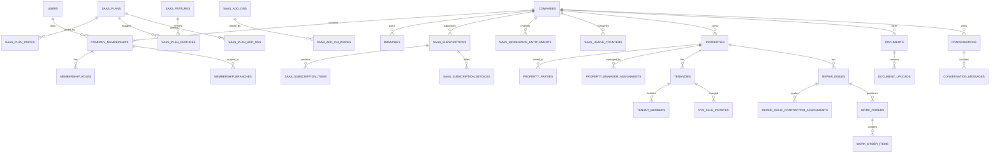

# Complete Resisquare SaaS database structure

## 1. Purpose

This document defines the complete target database structure for converting the current Resisquare Laravel CRM into a multi-tenant SaaS platform.

It is a logical and physical schema specification only. It does not contain Laravel migrations or executable SQL.

The structure supports:

- Resisquare Super Admin platform operations.
- Self-managing Landlord workspaces.
- Estate Agent workspaces with branches and staff.
- Property Manager access and assignments.
- Tenant, Contractor and Owner limited portals.
- Plans, prices, add-ons, subscriptions and Stripe billing.
- Properties, tenancies, rent accounting and maintenance.
- Documents, messages, calendar, reports and audit history.
- Workspace isolation, usage limits, exports and data retention.

## 2. Core architecture decisions

### 2.1 Universal workspace

`companies` is the SaaS workspace/tenant root for every paying customer:

- `workspace_type = landlord`: independent Landlord portfolio.
- `workspace_type = estate_agent`: Estate Agent company.

An individual Landlord still receives a `companies` row. This ensures every customer-owned record has the same `company_id` isolation key.

### 2.2 Global user identity

`users` represents a person/login identity. A user can belong to multiple workspaces through `company_memberships`.

`users.company_id`, `users.branch_id`, global roles and `selected_properties` may remain during migration, but they must not remain the final source of authorisation.

### 2.3 Workspace membership

Roles and permissions apply to a membership inside a workspace, not globally to the person.

Example:

- The same person may be a Landlord Admin in their own portfolio.
- They may also be an Owner portal contact inside an agency workspace.
- Purchasing a Landlord plan does not give them edit access to the agency workspace.

### 2.4 Tenant ownership

Every customer-owned table contains `company_id`.

`created_by` and `updated_by` are audit fields only. They do not determine record ownership.

### 2.5 Separate financial contexts

Resisquare SaaS subscription invoices are separate from property rent, landlord, tenant and contractor accounting records.

Use `saas_*` tables for Resisquare billing and the property-accounting tables for customer business transactions.

### 2.6 Stripe is asynchronous

Stripe webhooks are the authoritative source for subscription state. A browser success URL must never activate a workspace by itself.

## 3. Database conventions

| Convention | Rule |
|---|---|
| Primary key | `BIGINT UNSIGNED id` |
| Public identifier | UUID/ULID `public_id`, unique and safe for URLs |
| Tenant key | `company_id`, indexed and non-null after backfill |
| Money | Integer minor units for SaaS billing; decimal currency values for property accounting where retained |
| Currency | ISO 4217 uppercase code, initially `GBP` |
| Country | ISO 3166-1 alpha-2, initially `GB` |
| Timezone | IANA name, initially `Europe/London` |
| Dates | UTC timestamps in database; format as `DD/MM/YYYY` in UI |
| Soft deletion | Use only for recoverable non-financial records |
| Financial deletion | Never hard-delete posted financial records; reverse or void them |
| Statuses | Indexed strings controlled by application enums |
| JSON | Metadata/extension values only; do not store core relationships in JSON |
| Files | Private object storage key plus metadata; never public paths as authority |
| Audit | Actor, workspace, action, reason, request ID and timestamp |

## 4. Complete build order

The schema should be built and activated in this order:

1. Global identities and workspaces.
2. Workspace memberships, roles and branches.
3. Contacts and portal invitations.
4. SaaS feature and plan catalogue.
5. Stripe billing and subscription lifecycle.
6. Entitlements and usage counters.
7. Tenant keys on existing operational records.
8. Properties and property relationships.
9. Tenancies and portal assignments.
10. Compliance and maintenance.
11. Property accounting.
12. Documents, messages and calendar.
13. Platform auditing, support, exports and retention.
14. Backfill existing data.
15. Make tenant keys non-null and enable tenant-aware application reads.

## 5. Identity, workspace and access-control schema

### 5.1 `users`

Global person and authentication identity.

| Column | Type | Rules/purpose |
|---|---|---|
| `id` | BIGINT | Primary key |
| `public_id` | UUID/ULID | Unique public identity |
| `first_name` | VARCHAR(100) | Required for activated users |
| `middle_name` | VARCHAR(100) | Nullable |
| `last_name` | VARCHAR(100) | Required for activated users |
| `display_name` | VARCHAR(255) | Derived/search-friendly name |
| `email` | VARCHAR(255) | Unique, normalized lowercase |
| `phone` | VARCHAR(32) | Nullable, E.164 where possible |
| `password` | VARCHAR(255) | Password hash only |
| `email_verified_at` | TIMESTAMP | Nullable |
| `phone_verified_at` | TIMESTAMP | Nullable |
| `status` | VARCHAR(32) | `pending`, `active`, `blocked`, `disabled` |
| `can_login` | BOOLEAN | Login gate |
| `locale` | VARCHAR(16) | Default `en-GB` |
| `timezone` | VARCHAR(64) | Default `Europe/London` |
| `last_login_at` | TIMESTAMP | Nullable |
| `last_login_ip` | VARCHAR(45) | Nullable |
| `remember_token` | VARCHAR(100) | Framework token |
| `created_at`, `updated_at` | TIMESTAMP | Standard audit timestamps |
| `deleted_at` | TIMESTAMP | Nullable; avoid deletion when historical references exist |

Indexes:

- Unique `email`.
- Unique `public_id`.
- Index `(status, can_login)`.

### 5.2 `companies`

Universal customer workspace.

| Column | Type | Rules/purpose |
|---|---|---|
| `id` | BIGINT | Primary key |
| `public_id` | UUID/ULID | Unique public workspace ID |
| `slug` | VARCHAR(150) | Unique workspace route slug |
| `workspace_type` | VARCHAR(32) | `landlord` or `estate_agent` |
| `name` | VARCHAR(255) | Portfolio/company display name |
| `trading_name` | VARCHAR(255) | Nullable |
| `registration_number` | VARCHAR(50) | Nullable company number |
| `vat_number` | VARCHAR(50) | Nullable |
| `status` | VARCHAR(32) | Workspace lifecycle |
| `jurisdiction` | VARCHAR(32) | Default `england` |
| `timezone` | VARCHAR(64) | Default `Europe/London` |
| `currency` | CHAR(3) | Default `GBP` |
| `owner_user_id` | BIGINT FK users | Business owner reference |
| `billing_owner_user_id` | BIGINT FK users | Billing decision-maker |
| `stripe_customer_id` | VARCHAR(255) | Nullable, unique |
| `registered_address` | JSON or normalized address FK | Nullable |
| `communication_address` | JSON or normalized address FK | Nullable |
| `emails` | JSON | Secondary contact values only |
| `phones` | JSON | Secondary contact values only |
| `logo_path` | VARCHAR(2048) | Nullable storage reference |
| `stamp_path` | VARCHAR(2048) | Nullable |
| `website` | VARCHAR(2048) | Nullable |
| `social_media` | JSON | Nullable |
| `services` | JSON | Nullable |
| `onboarded_at` | TIMESTAMP | Nullable |
| `suspended_at` | TIMESTAMP | Nullable |
| `archived_at` | TIMESTAMP | Nullable |
| `lifecycle_reason` | TEXT | Nullable |
| `metadata` | JSON | Nullable non-authoritative extension data |
| `created_by`, `updated_by` | BIGINT FK users | Nullable audit actors |
| `created_at`, `updated_at` | TIMESTAMP | Standard timestamps |

Workspace statuses:

- `pending_verification`
- `pending_checkout`
- `trialing`
- `active`
- `past_due_grace`
- `past_due_restricted`
- `cancel_at_period_end`
- `cancelled`
- `suspended`
- `archived`

Indexes:

- Unique `public_id`, `slug`, `stripe_customer_id`.
- Index `(workspace_type, status)`.
- Index `billing_owner_user_id`.

### 5.3 `company_memberships`

User relationship with a workspace.

| Column | Type | Rules/purpose |
|---|---|---|
| `id` | BIGINT | Primary key |
| `public_id` | UUID/ULID | Unique |
| `company_id` | BIGINT FK companies | Tenant/workspace |
| `user_id` | BIGINT FK users | Identity |
| `membership_type` | VARCHAR(48) | Admin, staff or portal relationship |
| `status` | VARCHAR(32) | `invited`, `pending`, `active`, `suspended`, `revoked` |
| `is_billing_owner` | BOOLEAN | One active billing owner per workspace |
| `invited_by` | BIGINT FK users | Nullable |
| `invited_at` | TIMESTAMP | Nullable |
| `joined_at` | TIMESTAMP | Nullable |
| `last_accessed_at` | TIMESTAMP | Nullable |
| `suspended_at` | TIMESTAMP | Nullable |
| `suspension_reason` | TEXT | Nullable |
| `metadata` | JSON | Nullable |
| timestamps | TIMESTAMP | Created, updated, deleted |

Membership types:

- `workspace_admin`
- `branch_manager`
- `staff`
- `accountant`
- `property_manager`
- `landlord_contact`
- `owner_portal`
- `tenant_portal`
- `contractor_portal`

Constraints:

- Unique `(company_id, user_id)`.
- Index `(company_id, status)`.
- Physical user deletion must not erase historical actor references.

### 5.4 `membership_roles`

| Column | Type | Rules/purpose |
|---|---|---|
| `id` | BIGINT | Primary key |
| `company_membership_id` | BIGINT FK | Membership |
| `role_id` | BIGINT FK roles | Role template |
| `assigned_by` | BIGINT FK users | Nullable |
| `assigned_at` | TIMESTAMP | Required |

Unique `(company_membership_id, role_id)`.

### 5.5 `membership_permissions`

Workspace-specific permission overrides.

| Column | Type | Rules/purpose |
|---|---|---|
| `id` | BIGINT | Primary key |
| `company_membership_id` | BIGINT FK | Membership |
| `permission_id` | BIGINT FK permissions | Permission |
| `effect` | VARCHAR(16) | `allow` or `deny` |
| `assigned_by` | BIGINT FK users | Nullable |
| `assigned_at` | TIMESTAMP | Required |

Unique `(company_membership_id, permission_id)`.

### 5.6 `branches`

Estate Agent workspace only.

| Column | Type | Rules/purpose |
|---|---|---|
| `id` | BIGINT | Primary key |
| `public_id` | UUID/ULID | Unique |
| `company_id` | BIGINT FK companies | Required |
| `name` | VARCHAR(255) | Required |
| `is_head_office` | BOOLEAN | One per company |
| address fields | VARCHAR | UK address/postcode |
| contact fields | VARCHAR/JSON | Email/phone alternatives |
| `status` | VARCHAR(24) | `active`, `inactive`, `archived` |
| `created_by`, `updated_by` | BIGINT FK users | Audit |
| timestamps | TIMESTAMP | Standard timestamps |

Constraints:

- Unique `(company_id, name)`.
- One active head office per company, enforced by service/database capability.
- Landlord workspaces cannot create branches.

### 5.7 `membership_branches`

Limits Branch Managers/staff to selected branches.

| Column | Type |
|---|---|
| `id` | BIGINT |
| `company_membership_id` | BIGINT FK |
| `branch_id` | BIGINT FK |
| timestamps | TIMESTAMP |

Unique `(company_membership_id, branch_id)`. Both records must belong to the same company.

### 5.8 `contact_profiles`

Workspace-specific contact details for a global person.

| Column | Type | Rules/purpose |
|---|---|---|
| `id` | BIGINT | Primary key |
| `company_id` | BIGINT FK | Workspace |
| `user_id` | BIGINT FK users | Nullable until identity/invitation exists |
| `contact_type` | VARCHAR(48) | Landlord, owner, tenant, contractor, manager, other |
| `status` | VARCHAR(24) | Active/inactive/archived |
| `display_name` | VARCHAR(255) | Required |
| `email`, `phone` | VARCHAR | Nullable |
| address fields | VARCHAR | Nullable |
| `labels` | JSON | Nullable |
| `communication_preferences` | JSON | Nullable |
| `portal_access_enabled` | BOOLEAN | Default false |
| `created_by` | BIGINT FK users | Nullable |
| timestamps | TIMESTAMP | Standard and optional soft-delete |

Indexes:

- Unique `(company_id, user_id)` when user exists.
- Index `(company_id, contact_type, status)`.

### 5.9 `portal_invitations`

| Column | Type | Rules/purpose |
|---|---|---|
| `id` | BIGINT | Primary key |
| `public_id` | UUID/ULID | Unique |
| `company_id` | BIGINT FK | Workspace |
| `user_id` | BIGINT FK users | Nullable |
| `email` | VARCHAR(255) | Intended recipient |
| `membership_type` | VARCHAR(48) | Portal/access type |
| `token_hash` | CHAR(64) | Unique; never store raw token |
| `status` | VARCHAR(24) | Pending/accepted/expired/revoked |
| `invited_by` | BIGINT FK users | Nullable |
| `expires_at`, `accepted_at`, `revoked_at` | TIMESTAMP | Lifecycle |
| `metadata` | JSON | Intended entity assignments |
| timestamps | TIMESTAMP | Standard |

## 6. SaaS plan and pricing schema

### 6.1 `saas_features`

Stable feature/limit catalogue.

| Column | Type | Rules/purpose |
|---|---|---|
| `id` | BIGINT | Primary key |
| `code` | VARCHAR(80) | Unique stable code |
| `name` | VARCHAR(255) | Display name |
| `description` | TEXT | Nullable |
| `value_type` | VARCHAR(24) | Boolean, integer, decimal, text, JSON |
| `unit` | VARCHAR(32) | Property, branch, seat, GB etc. |
| `is_metered` | BOOLEAN | Whether usage is calculated |
| `is_active` | BOOLEAN | Catalogue status |
| `metadata` | JSON | Nullable |
| timestamps | TIMESTAMP | Standard |

Initial codes:

- `properties`
- `branches`
- `staff_seats`
- `administrators`
- `property_manager_seats`
- `storage_gb`
- `portal_users`
- `finance`
- `reports`
- `exports`

### 6.2 `saas_plans`

| Column | Type | Rules/purpose |
|---|---|---|
| `id` | BIGINT | Primary key |
| `public_id` | UUID/ULID | Unique |
| `code` | VARCHAR(80) | Unique stable plan code |
| `workspace_type` | VARCHAR(32) | Landlord or Estate Agent |
| `name` | VARCHAR(255) | Display name |
| `description` | TEXT | Nullable |
| `trial_days` | SMALLINT UNSIGNED | Default 0 or 14 |
| `requires_payment_method_for_trial` | BOOLEAN | Default true |
| `is_active` | BOOLEAN | Administrative state |
| `is_published` | BOOLEAN | Public pricing visibility |
| `is_featured` | BOOLEAN | Pricing presentation |
| `display_order` | INT UNSIGNED | Sort order |
| `created_by`, `updated_by` | BIGINT FK users | Audit |
| `metadata` | JSON | Nullable |
| timestamps | TIMESTAMP | Standard plus optional soft-delete |

### 6.3 `saas_plan_prices`

Versioned base-plan price.

| Column | Type | Rules/purpose |
|---|---|---|
| `id` | BIGINT | Primary key |
| `saas_plan_id` | BIGINT FK | Plan |
| `billing_interval` | VARCHAR(16) | `month` or `year` |
| `interval_count` | SMALLINT | Default 1 |
| `currency` | CHAR(3) | `GBP` |
| `unit_amount` | BIGINT UNSIGNED | Pence |
| `tax_behavior` | VARCHAR(24) | `exclusive`, `inclusive`, `unspecified` |
| `stripe_product_id` | VARCHAR(255) | Indexed |
| `stripe_price_id` | VARCHAR(255) | Unique |
| `livemode` | BOOLEAN | Test/live separation |
| `is_active` | BOOLEAN | Available for new purchase |
| `active_from`, `active_until` | TIMESTAMP | Version validity |
| `metadata` | JSON | Nullable |
| timestamps | TIMESTAMP | Standard |

Do not update the amount of a price already used by a subscription. Create a new price record.

### 6.4 `saas_plan_features`

| Column | Type | Rules/purpose |
|---|---|---|
| `id` | BIGINT | Primary key |
| `saas_plan_id` | BIGINT FK | Plan |
| `saas_feature_id` | BIGINT FK | Feature |
| `value_boolean` | BOOLEAN | Nullable |
| `value_integer` | BIGINT | Nullable capacity |
| `value_decimal` | DECIMAL(18,4) | Nullable |
| `value_text` | TEXT | Nullable |
| `value_json` | JSON | Nullable |
| `is_unlimited` | BOOLEAN | Overrides quantity value |
| timestamps | TIMESTAMP | Standard |

Unique `(saas_plan_id, saas_feature_id)`.

### 6.5 `saas_add_ons`

| Column | Type | Rules/purpose |
|---|---|---|
| `id` | BIGINT | Primary key |
| `public_id` | UUID/ULID | Unique |
| `code` | VARCHAR(80) | Unique |
| `name`, `description` | VARCHAR/TEXT | Display content |
| `saas_feature_id` | BIGINT FK | Capacity/feature increased |
| `quantity_increment` | BIGINT | Entitlement per purchased quantity |
| `allowed_workspace_types` | JSON | Landlord/Estate Agent availability |
| `is_active`, `is_published` | BOOLEAN | Catalogue state |
| `display_order` | INT | Sort order |
| `metadata` | JSON | Nullable |
| timestamps | TIMESTAMP | Standard plus soft-delete |

### 6.6 `saas_add_on_prices`

Same commercial fields as `saas_plan_prices`, referencing `saas_add_on_id`.

### 6.7 `saas_plan_add_ons`

| Column | Type |
|---|---|
| `id` | BIGINT |
| `saas_plan_id` | BIGINT FK |
| `saas_add_on_id` | BIGINT FK |
| `minimum_quantity` | INT UNSIGNED |
| `maximum_quantity` | INT UNSIGNED nullable |
| timestamps | TIMESTAMP |

Unique `(saas_plan_id, saas_add_on_id)`.

## 7. SaaS subscription and Stripe schema

### 7.1 `saas_billing_profiles`

| Column | Type | Rules/purpose |
|---|---|---|
| `id` | BIGINT | Primary key |
| `company_id` | BIGINT FK | Unique workspace billing profile |
| `billing_name` | VARCHAR(255) | Required |
| `billing_email` | VARCHAR(255) | Required |
| `billing_phone` | VARCHAR(32) | Nullable |
| address fields | VARCHAR | Billing address |
| `country_code` | CHAR(2) | Default GB |
| `tax_id`, `tax_id_type` | VARCHAR | Nullable |
| `stripe_tax_id` | VARCHAR(255) | Nullable |
| `metadata` | JSON | Nullable |
| timestamps | TIMESTAMP | Standard |

### 7.2 `saas_subscriptions`

Local projection of a Stripe subscription.

| Column | Type | Rules/purpose |
|---|---|---|
| `id` | BIGINT | Primary key |
| `public_id` | UUID/ULID | Unique |
| `company_id` | BIGINT FK | Paying workspace |
| `saas_plan_id` | BIGINT FK | Current plan |
| `saas_plan_price_id` | BIGINT FK | Purchased base price version |
| `stripe_customer_id` | VARCHAR(255) | Indexed |
| `stripe_subscription_id` | VARCHAR(255) | Unique |
| `status` | VARCHAR(32) | Local/Stripe lifecycle |
| `livemode` | BOOLEAN | Test/live |
| `is_current` | BOOLEAN | Current subscription marker |
| `collection_method` | VARCHAR(32) | Usually automatic charge |
| trial timestamps | TIMESTAMP | Start/end |
| current period timestamps | TIMESTAMP | Start/end |
| `cancel_at_period_end` | BOOLEAN | Cancellation state |
| cancellation/end timestamps | TIMESTAMP | Nullable |
| delinquency/grace/restriction timestamps | TIMESTAMP | Nullable |
| Stripe create/update timestamps | TIMESTAMP | Ordering protection |
| `last_synced_at` | TIMESTAMP | Reconciliation |
| `metadata` | JSON | Nullable |
| timestamps | TIMESTAMP | Standard |

Subscription statuses:

- `pending`
- `trialing`
- `active`
- `past_due`
- `unpaid`
- `paused`
- `cancel_at_period_end`
- `cancelled`
- `incomplete`
- `incomplete_expired`

Index `(company_id, is_current, status)`.

### 7.3 `saas_subscription_items`

Base plan plus add-ons on one Stripe subscription.

| Column | Type | Rules/purpose |
|---|---|---|
| `id` | BIGINT | Primary key |
| `saas_subscription_id` | BIGINT FK | Subscription |
| `item_type` | VARCHAR(24) | `base_plan` or `add_on` |
| `saas_plan_price_id` | BIGINT FK | Nullable for add-on |
| `saas_add_on_price_id` | BIGINT FK | Nullable for base |
| `stripe_subscription_item_id` | VARCHAR(255) | Unique |
| `stripe_product_id`, `stripe_price_id` | VARCHAR | Indexed references |
| `quantity` | INT UNSIGNED | Default 1 |
| `currency` | CHAR(3) | GBP |
| `unit_amount` | BIGINT | Purchased price snapshot |
| `active_from`, `active_until` | TIMESTAMP | Nullable |
| `metadata` | JSON | Nullable |
| timestamps | TIMESTAMP | Standard |

### 7.4 `saas_checkout_attempts`

| Column | Type | Rules/purpose |
|---|---|---|
| `id` | BIGINT | Primary key |
| `public_id` | UUID/ULID | Unique |
| `company_id`, `user_id` | BIGINT FK | Pending buyer/workspace |
| `saas_plan_id`, `saas_plan_price_id` | BIGINT FK | Server-resolved selection |
| `idempotency_key` | VARCHAR(255) | Unique |
| `stripe_checkout_session_id` | VARCHAR(255) | Nullable, unique |
| Stripe customer/subscription IDs | VARCHAR | Nullable |
| `status` | VARCHAR(32) | Pending/completed/cancelled/expired/failed |
| `currency` | CHAR(3) | GBP |
| subtotal/tax/total amounts | BIGINT | Pence |
| `selection_snapshot` | JSON | Server-generated immutable summary |
| expiry/completion/cancellation timestamps | TIMESTAMP | Nullable |
| `metadata` | JSON | Nullable |
| timestamps | TIMESTAMP | Standard |

### 7.5 `saas_webhook_events`

| Column | Type | Rules/purpose |
|---|---|---|
| `id` | BIGINT | Primary key |
| `stripe_event_id` | VARCHAR(255) | Unique idempotency boundary |
| `event_type` | VARCHAR(120) | Indexed |
| `object_type`, `object_id` | VARCHAR | Nullable/indexed |
| `livemode` | BOOLEAN | Test/live |
| `api_version` | VARCHAR(32) | Nullable |
| `payload_hash` | CHAR(64) | SHA-256 |
| `payload_minimized` | JSON | Optional safe subset only |
| `status` | VARCHAR(24) | Received/processing/processed/failed/ignored |
| `attempt_count` | INT | Default 0 |
| event/received/processing timestamps | TIMESTAMP | Lifecycle |
| `last_error` | TEXT | Sanitized failure |
| timestamps | TIMESTAMP | Standard |

### 7.6 `saas_subscription_invoices`

Stripe SaaS invoice projection, not property invoice.

Key columns:

- `company_id`, `saas_subscription_id`.
- Unique `stripe_invoice_id`.
- Stripe Payment Intent and invoice number.
- Status and currency.
- Subtotal, tax, total, paid and due amounts in minor units.
- Hosted invoice and PDF URLs.
- Period, due, paid and void timestamps.
- Metadata and standard timestamps.

### 7.7 `saas_invoice_lines`

Key columns:

- `saas_subscription_invoice_id`.
- Unique `stripe_invoice_line_id`.
- Description and Stripe Price ID.
- Quantity, unit amount and signed line amount.
- Proration flag.
- Billing period and metadata.

### 7.8 `saas_subscription_changes`

Scheduled upgrades, downgrades, add-on changes or cancellations.

Key columns:

- Workspace and subscription.
- Change type and status.
- Before/after JSON snapshots.
- Effective/applied/cancelled timestamps.
- Requested-by user and reason.

### 7.9 `saas_subscription_status_history`

Immutable transition log with subscription, old/new status, source, Stripe event, actor, reason, metadata and timestamp.

## 8. Entitlements and usage schema

### 8.1 `saas_workspace_entitlements`

One materialized current entitlement per workspace/feature.

Columns:

- `company_id`, `saas_feature_id`.
- Typed feature value fields and `is_unlimited`.
- Version.
- Source summary describing plan/add-on derivation.
- Effective, expiry and calculation timestamps.

Unique `(company_id, saas_feature_id)`.

### 8.2 `saas_usage_counters`

Current fast usage value.

Columns:

- Workspace and feature.
- `scope_key`, default `current`.
- `current_value`.
- Optional measurement period.
- Calculation/last-event timestamps and metadata.

Unique `(company_id, saas_feature_id, scope_key)`.

### 8.3 `saas_usage_events`

Idempotent usage history.

Columns:

- Workspace and feature.
- Unique `idempotency_key`.
- Event type.
- Quantity delta and quantity after.
- Polymorphic source record.
- Actor, metadata and occurrence timestamp.

## 9. Property and portfolio schema

### 9.1 `properties`

Retain existing detailed property fields and add/standardize the following core structure.

| Column group | Required fields |
|---|---|
| Identity | `id`, unique `public_id`, `company_id`, optional `branch_id`, company-scoped `prop_ref_no` |
| Address | name, address lines, city, county, postcode, country |
| Classification | property type, specific type, tenure, transaction type |
| Physical details | bedrooms, bathrooms, reception, parking, garden, floor and area |
| Commercial details | currency, asking/rent price, service/ground/estate charges, council tax |
| Management | branch, manager assignment relation, service/management flags |
| Availability | availability date and occupancy/letting status |
| Compliance summary | EPC rating, gas indicator and risk summary |
| Media | photos, floor plan, video/360 references through files/documents |
| Lifecycle | `lifecycle_status`, `archived_at`, soft deletion only where appropriate |
| Audit | created/updated/deleted actors and timestamps |

Constraints:

- Unique `(company_id, prop_ref_no)`.
- Branch must belong to the same company.
- `company_id` cannot change after creation except audited data correction.
- Archived properties do not consume active-property capacity.

### 9.2 `property_parties`

Replaces ambiguous owner/landlord links.

Columns:

- `company_id`, `property_id`.
- `user_id` or `contact_profile_id`.
- `party_role`: landlord, legal owner, beneficial owner, agent contact.
- Primary flag and ownership percentage.
- Financial/document visibility.
- Valid-from/until dates and metadata.

### 9.3 `property_manager_assignments`

Columns:

- Workspace, property and manager membership.
- Status and permission snapshot.
- Start/end dates.
- Assigned-by actor and timestamps.

The manager membership must belong to the same workspace and have an allowed role/add-on entitlement.

## 10. Tenancy schema

### 10.1 `tenancies`

| Column group | Required fields |
|---|---|
| Identity | `id`, `public_id`, `company_id`, `property_id`, company-scoped reference |
| Type/state | tenancy type, England-aware periodic/fixed details, status, jurisdiction |
| Dates | commencement, notice, move-in, move-out, renewal/end |
| Rent | amount, frequency, due day, currency |
| Deposit | amount and relation to deposit record |
| Management | assigned property manager membership |
| Audit | created/updated/deleted actors and timestamps |

Unique `(company_id, reference_number)`.

### 10.2 `tenant_members`

Columns:

- `company_id`, `tenancy_id`, `user_id`/contact profile.
- Main tenant flag.
- Member status and valid dates.
- Legally required signed-name/contact snapshots where necessary.
- Portal visibility and timestamps.

### 10.3 `tenancy_deposits`

Recommended normalized deposit record:

- Workspace and tenancy.
- Amount, received date and holder.
- Protection scheme and reference.
- Protected/prescribed-information dates.
- Evidence document.
- Status and audit timestamps.

### 10.4 `recurring_rent_charges`

Rent invoice schedule:

- Workspace, tenancy and property.
- Amount, frequency, start/end, next generation date.
- Income/ledger account references.
- Status and generation settings.
- Created/updated actors and timestamps.

### 10.5 `portal_shares`

Explicit fine-grained access to a property, tenancy, document, report or job.

Columns:

- Workspace and target membership.
- Polymorphic shared entity.
- Permission JSON.
- Start/expiry/revocation timestamps.
- Shared-by actor.

## 11. Compliance schema

### 11.1 `compliance_types`

Workspace/global compliance catalogue:

- Company nullable for platform defaults.
- Code, name, jurisdiction and property applicability.
- Default validity period and reminder schedule.
- Active state and guidance text.

### 11.2 `compliance_records`

- `company_id`, `property_id`, `compliance_type_id`.
- Certificate/reference number.
- Issue and expiry dates.
- Status: valid, expiring, expired, missing, not-applicable.
- Responsible membership.
- Evidence document/file.
- Verification date/actor and notes.
- Timestamps.

### 11.3 `compliance_reminders`

- Workspace and compliance record.
- Scheduled/sent timestamp.
- Channel, recipient membership/user.
- Status, attempt count and failure reason.

## 12. Maintenance, contractors and work-order schema

The current `repair_*` tables may retain their physical names during migration, but the target product term is Maintenance.

### 12.1 `repair_issues` / maintenance requests

Required structure:

- Public ID, company, property and reporter.
- Tenant/portal relationship.
- Category, description, urgency/priority.
- Access notes and availability.
- Status and sub-status.
- Assigned manager.
- SLA, acknowledgement, resolution and closure timestamps.
- Final contractor/assignment.
- Estimated/approved/actual costs.
- Created/updated actors and timestamps.

Company-scoped unique maintenance reference.

### 12.2 `repair_photos` / maintenance attachments

- Company and request.
- Upload/file relation.
- Attachment stage: report, quote, progress, completion, invoice.
- Visibility: internal, tenant, contractor, shared.
- Uploader and timestamp.

### 12.3 `repair_issue_property_managers`

- Company, request and manager membership.
- Assignment status, assigned-by and timestamps.

### 12.4 `repair_issue_contractor_assignments`

Quote request/contractor assignment:

- Company and maintenance request.
- Contractor membership/contact.
- Secure token hash, expiry and revocation state.
- Quote-request status.
- Submitted price, VAT, availability, notes and submission time.
- Selection/final-contractor state.
- Audit timestamps.

### 12.5 `work_orders`

- Public ID, company and company-scoped work-order number.
- Maintenance request and selected contractor assignment.
- Job type/status/scope.
- Scheduled/start/end dates.
- Estimated, actual and landlord-charge values.
- Acceptance, progress, completion and closure timestamps.
- Invoice/payment references.
- Audit actors and timestamps.

Unique `(company_id, works_order_no)`.

### 12.6 `work_order_items`

- Company and work order.
- Description, quantity, unit, rate, VAT and line total.
- Sort order and timestamps.

### 12.7 `contractor_invoices`

- Company, work order and contractor.
- Contractor invoice number/date.
- Net, VAT and gross values.
- File/document relation.
- Review/approval/payment status.
- Approved/rejected actors and timestamps.

### 12.8 `maintenance_events`

Immutable workflow timeline:

- Company and request/work order.
- Event type, actor and audience visibility.
- Safe metadata and occurrence timestamp.

## 13. Documents and file storage schema

### 13.1 `uploads` / files

Recommended file metadata:

- `id`, public ID and `company_id`.
- Uploader user/membership.
- Storage disk and private object key.
- Original and stored filename.
- MIME type, extension and byte size.
- SHA-256 checksum.
- Visibility.
- Malware scan status/time.
- Created and soft-deleted timestamps.

Storage keys, caches and signed downloads must include workspace context.

### 13.2 `document_types`

- Company nullable for platform defaults.
- Code/name/entity applicability.
- Expiry/reminder support.
- Active flag and timestamps.

### 13.3 `documents`

- Company and public ID.
- Polymorphic documentable entity.
- Document type.
- Title/description.
- Visibility: private, internal, shared.
- Issue/expiry dates.
- Uploader and timestamps.
- Soft-delete where legally appropriate.

### 13.4 `document_uploads`

Normalized many-to-many relation:

- Document and upload.
- Primary flag and display order.
- Unique `(document_id, upload_id)`.

### 13.5 `notes`

- Company and polymorphic noteable entity.
- Author membership/user.
- Content and note type.
- Visibility, default internal.
- Created, updated and optional soft-delete timestamps.

## 14. Messaging schema

### 14.1 `conversations`

- Public ID, company and optional linked property/tenancy/job context.
- Subject and status.
- Creator, last-message and closure timestamps.

### 14.2 `conversation_participants`

- Conversation.
- Membership/user participant.
- Joined/left/last-read timestamps.
- Notification mute flag.

### 14.3 `conversation_messages`

- Public ID, company and conversation.
- Sender membership/user.
- Body, source and delivery status.
- Sent, edited and soft-deleted timestamps.
- Safe metadata.

### 14.4 `conversation_attachments`

- Message and upload.
- Unique `(message_id, upload_id)`.

## 15. Calendar schema

### 15.1 `events`

- Public ID and company.
- Parent/master recurrence relation.
- Title, type/sub-type and status.
- Start/end UTC timestamps and timezone.
- Location and description.
- RRULE and recurrence exception data.
- Creator and visibility.
- Timestamps.

### 15.2 `eventables`

Polymorphic link between an event and property, tenancy, maintenance request, compliance record or work order.

### 15.3 `event_participants`

- Event and membership/user.
- Required/optional role.
- Response status and response time.

### 15.4 `event_reminders`

- Company, event and recipient.
- Channel and scheduled time.
- Delivery status, attempts and failure reason.

## 16. Property accounting schema

Use one canonical accounting path. The current `sys_*` invoice/receipt/payment lifecycle is the preferred consolidation target, subject to accounting review.

Every table below requires `company_id`.

### 16.1 Master data

- `gl_accounts`: company-scoped chart of accounts.
- `sys_taxes`: tax code/rate and validity.
- `sys_income_categories` and `sys_expense_categories`.
- `payment_methods`.
- `sys_bank_accounts`.
- `document_sequences`: company-specific number sequences.

Key constraints:

- Unique `(company_id, gl account code)`.
- Unique `(company_id, bank account identifier)` as appropriate.
- Unique `(company_id, document type, sequence key)`.

### 16.2 `sys_sale_invoices`

- Company, public ID and company-scoped invoice number.
- Customer/contact, property and tenancy.
- Invoice/due dates and currency.
- Net, tax, total, paid and balance values.
- Draft/issued/partial/paid/overdue/cancelled status.
- Recurring-charge/source references.
- Created/issued/cancelled actors and timestamps.

Unique `(company_id, invoice_no)`.

### 16.3 `sys_sale_invoice_items`

- Company and sale invoice.
- Item/description, quantity, rate and discount.
- Tax code/rate/amount and line total.
- Property/tenancy/service-period context where required.

### 16.4 `sys_purchase_invoices`

Same header principles as sale invoices, referencing supplier/contractor and optionally a work order.

### 16.5 `sys_purchase_invoice_items`

Purchase line items with quantity, rate, tax, total and accounting allocation.

### 16.6 `sys_receipts`

- Company and company-scoped receipt number.
- Payer/contact.
- Receipt date, amount, bank account and payment method.
- Receiptable source, reference and status.
- Reversal/void fields and audit actors.

### 16.7 `sys_payments`

- Company, payee, bank/payment method.
- Payment type/date/amount.
- Purchase invoice/work-order/reference relation.
- Idempotency/reference metadata.
- Void/reversal state and actors.

### 16.8 `sys_refunds` and adjustment notes

- Company, original transaction/note and user/contact.
- Amount, date, method, bank and reason.
- Approval, posting and reversal state.

### 16.9 General ledger

#### `gl_journals`

- Company, public ID, journal number/date.
- Source type/id.
- Memo, status and posting/reversal fields.
- Created/posted/reversed actors and timestamps.

#### `gl_journal_lines`

- Company, journal and GL account.
- Debit/credit amount.
- Contact, property, tenancy, branch and source context.
- Description and timestamps.

Journal debits must equal credits per company/currency.

#### `gl_account_balances`

- Company, account, period and currency.
- Opening, debit, credit and closing balances.
- Unique `(company_id, account_id, period)`.

### 16.10 Banking and reconciliation

- `bank_reconciliations`: company, account, period, statement balance and status.
- `bank_reconciliation_lines`: statement line, matched transaction and difference.
- `gl_period_closes`: company, period, close/reopen actor and audit reason.
- `fixed_assets`: company, category, acquisition/depreciation/disposal data.

## 17. Platform operations and governance schema

### 17.1 `workspace_activity_events`

Customer-visible/internal product timeline with company, actor, verb, subject, related entity, visibility, metadata and occurrence timestamp.

### 17.2 `platform_audit_events`

Immutable platform/security audit:

- Public ID and optional target company.
- Actor and action.
- Polymorphic target.
- Reason, old/new values and metadata.
- Request ID, IP, user agent and timestamp.

### 17.3 `support_access_sessions`

- Target company and Resisquare support user.
- Approval actor and reason.
- Requested/approved/active/ended/expired status.
- Start/expiry/end timestamps.
- Allowed scope JSON.

### 17.4 `legal_documents`

- Document type, version and title.
- Content URL/hash.
- Published/effective timestamps and active state.
- Unique `(document_type, version)`.

### 17.5 `legal_acceptances`

- Legal document, user and optional company.
- IP, user agent and accepted timestamp.
- Unique acceptance for document/user/workspace.

### 17.6 `workspace_data_exports`

- Public ID, company and requester.
- Scope/format and status.
- Private storage location, checksum and size.
- Start/completion/expiry/failure timestamps.

### 17.7 `workspace_retention_actions`

- Company and action type.
- Scheduled/running/completed/cancelled status.
- Schedule/lifecycle timestamps.
- Request/approval actors, reason and result.

### 17.8 `notification_logs`

- Company, recipient and notification type.
- Channel, template version and related entity.
- Delivery provider/reference.
- Status, attempts, sent/delivered/failed timestamps.
- Sanitized error data.

## 18. Relationship overview

## 19. Required tenant-isolation rules

1. Resolve the current Company from an authenticated active membership.
2. Never accept normal form `company_id` as authority.
3. Set `company_id` from server-side workspace context.
4. All list/show/update/delete/archive/search/export/download queries include Company scope.
5. Route model binding checks both identifier and Company.
6. Raw SQL and reports contain explicit Company predicates.
7. Jobs carry Company ID and establish workspace context.
8. Cache, lock, export and object-storage keys include Company public ID.
9. Signed portal/quote links include Company/assignment context and expiry.
10. Super Admin bypass is explicit, restricted and audited.

For every customer-owned table, automated tests must prove Workspace A cannot list, view, update, archive, download, export or infer Workspace B's records.

## 20. Critical unique keys and indexes

- `companies.public_id`, `companies.slug`, `companies.stripe_customer_id` unique.
- `company_memberships(company_id, user_id)` unique.
- `membership_branches(membership_id, branch_id)` unique.
- `branches(company_id, name)` unique.
- `properties(company_id, prop_ref_no)` unique.
- `tenancies(company_id, reference_number)` unique.
- `work_orders(company_id, works_order_no)` unique.
- Property invoices/receipts/payment references unique per Company.
- `saas_features.code`, `saas_plans.code`, `saas_add_ons.code` unique.
- All Stripe Price, Subscription, Subscription Item, Invoice, Checkout Session and Event IDs unique.
- `saas_workspace_entitlements(company_id, feature_id)` unique.
- `saas_usage_counters(company_id, feature_id, scope_key)` unique.
- Portal/invitation tokens stored as unique hashes.
- Common list indexes begin with `company_id`, followed by status/date/branch.
- Polymorphic customer-owned tables index `(company_id, type, id)`.

## 21. Initial commercial catalogue

### Landlord plan

| Item | Value |
|---|---|
| Monthly price | GBP 19 + VAT |
| Annual price | GBP 190 + VAT |
| Active properties | 5 |
| Administrators | 1 |
| Portal users | Unlimited assigned users |
| Storage | 5 GB |
| Trial | 14 days, card required |

### Estate Agent plan

| Item | Value |
|---|---|
| Monthly price | GBP 149 + VAT |
| Annual price | GBP 1,490 + VAT |
| Active properties | 100 |
| Branches | 2 |
| Staff seats | 5 |
| Portal contacts | Unlimited |
| Storage | 25 GB |

### Add-ons

- Landlord Property Manager seat.
- Extra branch.
- Extra staff seat.
- Landlord +10 properties.
- Agency +100 properties.
- +25 GB storage.

## 22. Data migration and activation sequence

### Stage 1: Inventory

- Export table/column/index/foreign-key definitions from the actual database.
- Reconcile migration files with the live schema.
- Report every current record's possible Company from explicit Company, creator, property, branch and user links.

### Stage 2: Add SaaS foundation

- Add workspace fields.
- Add memberships and scoped permissions.
- Add plan, price, billing, subscription and entitlement tables.
- Keep operational tenant keys nullable temporarily.

### Stage 3: Workspace backfill

- Preserve existing Estate Agent companies.
- Create a portfolio workspace for each independent Landlord.
- Generate public IDs/slugs.
- Map owners, billing owners, staff and portal memberships.

### Stage 4: Operational backfill

- Backfill properties first.
- Inherit Company to tenancies, maintenance, work orders and documents from verified parents.
- Backfill accounting using verified property/tenancy/contact/source relations.
- Quarantine ambiguous/cross-company records for manual review.

### Stage 5: Dual-read verification

- Compare old creator-based results with new Company-scoped results.
- Investigate mismatches.
- Start writing `company_id` from workspace context.
- Add isolation tests before switching reads.

### Stage 6: Enforcement

- Make required tenant keys non-null.
- Add Company-scoped unique constraints.
- Switch policies, binding, searches, reports, jobs, files and exports.
- Stop using `created_by`, global roles and selected-properties JSON for access.

### Stage 7: Billing activation

- Seed feature/plan catalogue.
- Map Stripe test Products/Prices.
- Implement Checkout and verified webhooks.
- Provision only after trialing/active subscription state.
- Test limits, cancellation and payment failure.

### Stage 8: Production rollout

- Rehearse on a production copy.
- Back up production.
- Deploy in controlled stages.
- Run isolation and Stripe smoke tests.
- Monitor webhook failures, tenant-scope violations and billing mismatches.

## 23. Final schema completion criteria

The database conversion is complete only when:

- Every paying customer has a Company workspace.
- Every active user has the correct membership(s).
- Every customer-owned record has a valid non-null `company_id`.
- Cross-company relationships are rejected.
- Business references are unique within the Company.
- Plan limits derive from entitlement tables.
- SaaS billing is separate from property accounting.
- Stripe events are signature-verified and idempotent.
- Portal users see only assigned/shared entities.
- File storage, messages, jobs, caches, reports and exports are workspace-scoped.
- Super Admin support access is audited.
- Cancellation retains records according to the approved retention policy.
- Two-workspace isolation tests pass for every exposed module.

